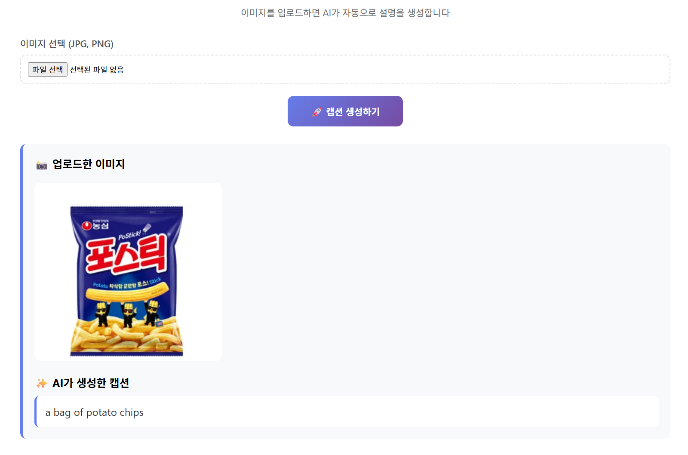
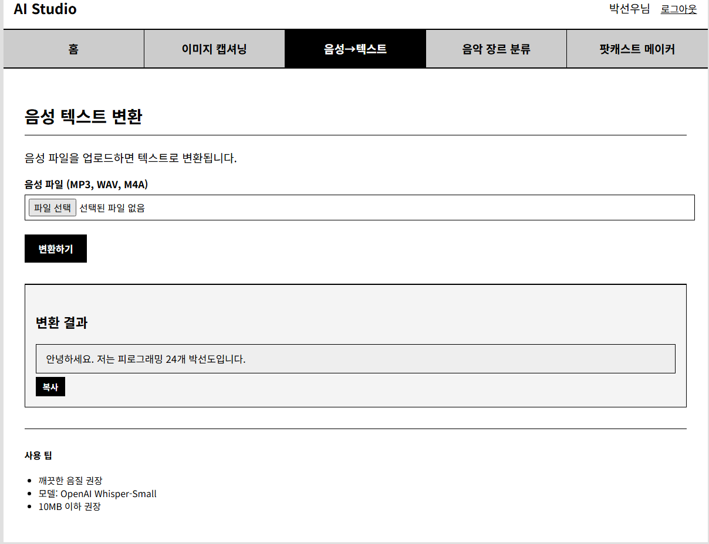
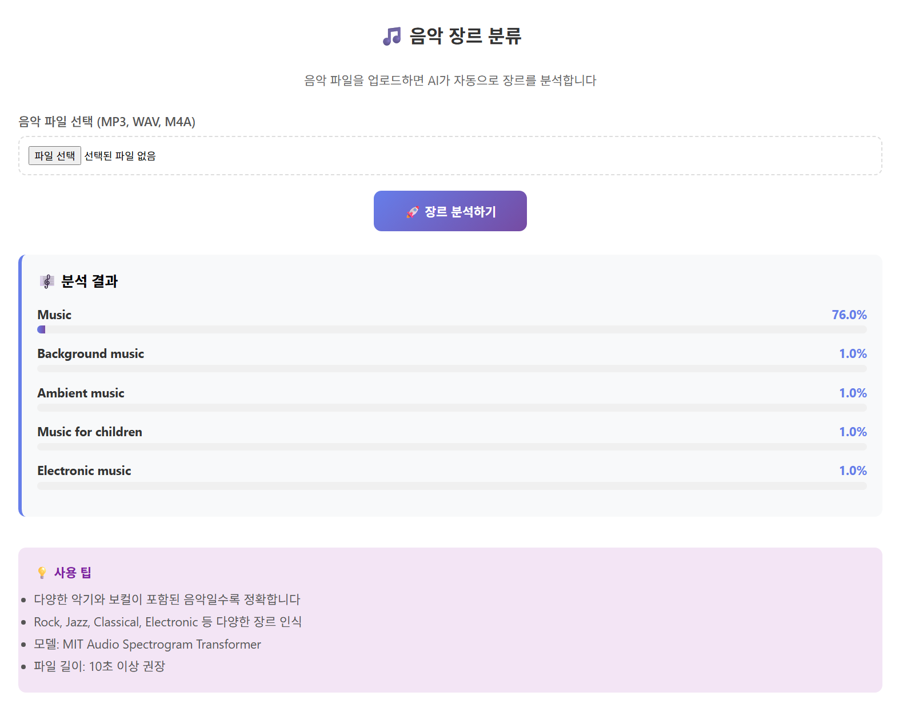
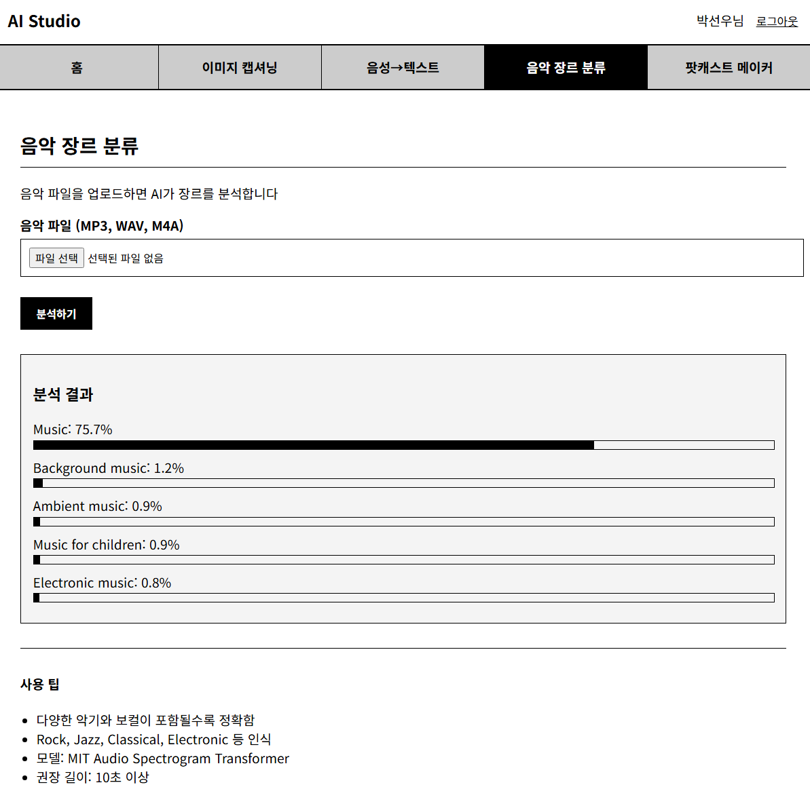
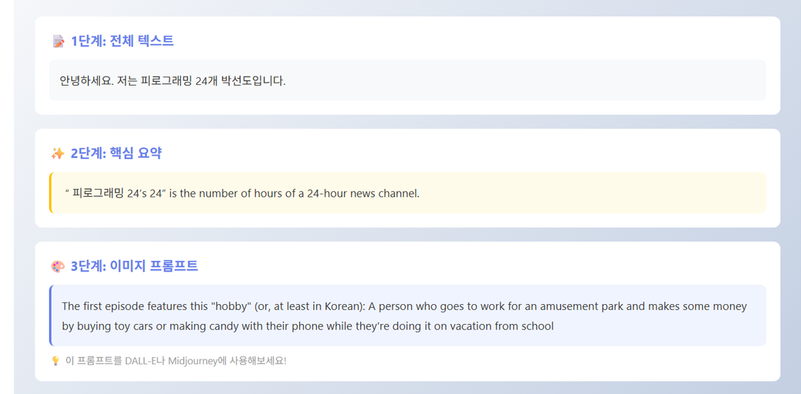

# 나만의 AI 사이트 (Django)

AI 모델을 활용한 멀티미디어 처리 웹 서비스

---

## 프로젝트 설명

Django와 Hugging Face Transformers를 활용하여 이미지, 음성, 텍스트를 처리하는 AI 웹 서비스입니다.

---

## 사용 모델 (3개 이상)

### 1. Salesforce/blip-image-captioning-base
- **태스크**: Image Captioning (이미지 캡셔닝)
- **입력 예시**: 고양이 사진 (JPG, PNG)
- **출력 예시**: "A fluffy orange cat sitting on a windowsill"
- **접근 권한**: 비로그인 사용 가능 (공개 탭)
- 실행 화면 예시:
-->!

### 2. openai/whisper-tiny
- **태스크**: Automatic Speech Recognition (음성 인식)
- **입력 예시**: 강의 녹음 파일 (MP3, WAV, M4A)
- **출력 예시**: "안녕하세요, 오늘은 Django에 대해 배워보겠습니다."
- **접근 권한**: 로그인 필요
- 실행 화면 예시:
-->!

### 3. MIT/ast-finetuned-audioset-10-10-0.4593
- **태스크**: Audio Classification (음악 장르 분류)
- **입력 예시**: 음악 파일 (MP3, WAV)
- **출력 예시**: 
  - Rock: 85%
  - Jazz: 10%
  - Classical: 5%
- **접근 권한**: 로그인 필요
- 실행 화면 예시:
-->!
    

### 4. 챌린지 - 복합 AI 파이프라인 (팟캐스트 메이커)
- **사용 모델**: 
  1. `openai/whisper-tiny` (음성→텍스트)
  2. `facebook/bart-large-cnn` (텍스트 요약)
  3. `gpt2` (이미지 프롬프트 생성)
- **입력**: 팟캐스트 음성 파일
- **출력**: 
  - 전체 텍스트 변환
  - 핵심 내용 요약
  - AI 생성 이미지 프롬프트
- **접근 권한**: 로그인 필요
- 실행 화면 예시:
-->!

---

## 로그인 제한 (Access Control)

### 공개 탭 (1개)
- **이미지 캡셔닝**: 비로그인 사용자도 접근 가능

### 제한 탭 (3개)
- **음성→텍스트**: 로그인 필요
- **음악 장르 분류**: 로그인 필요
- **팟캐스트 메이커**: 로그인 필요  

---

## 설치 및 실행 방법

### 1. 사전 요구사항

#### FFmpeg 설치 (음성 처리 필수)
pip install static-ffmpeg

# Django
Django>=5.0.0

# 환경 변수 관리
python-dotenv

# 이미지 처리
Pillow

# AI/ML 라이브러리
transformers>=4.30.0
torch>=2.0.0
torchaudio>=2.0.0

#### Hugging Face 토큰 발급
1. https://huggingface.co/ 회원가입
2. Settings → Access Tokens → New Token 생성
3. `.env` 파일에 저장

---
## 로그인 제한(Access Control)

- 비로그인 사용자는**1개 탭만 사용 가능**
- 제한 탭 접근 시**“로그인 후 이용해주세요” alert 후 로그인 페이지로 이동**
- 로그인 성공 시**원래 페이지로 복귀(next)**

---
## 구현 체크리스트

- [ㅇ] 탭 3개 이상 + 각 탭 별 URL 분리
- [ㅇ] 각 탭: 입력 → 실행 → 결과 출력
- [ㅇ] 에러 처리: 모델 호출 실패 시 사용자에게 메시지 표시
- [ㅇ] 로딩 표시(최소한 “처리 중…” 텍스트라도)
- [ㅇ] 요청 히스토리 5개
- [ㅇ]`.env` 사용 (토큰/API Key 노출 금지)
- [ㅇ]`README.md`에 모델 정보/사용 예시/실행 방법 작성 후 GitHub push

### 로그인 제한 체크
- [ㅇ] 비로그인 사용자는 1개 탭만 접근 가능
- [ㅇ] 제한 탭 접근 시 alert 후 로그인 페이지로 redirect
- [ㅇ] 로그인 성공 시 원래 페이지로 복귀(next)
